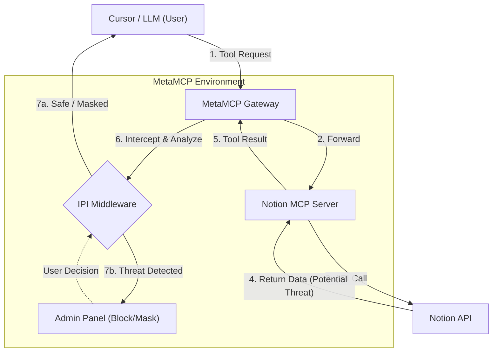

# 🚀 MetaMCP Gateway: 빌드 가이드

이 문서는 **MetaMCP Gateway** 프로젝트를 **처음부터(Zero) 실행하여 완벽하게 활용하는(Hero)** 단계까지 안내하는 통합 가이드입니다. 
환경 설정, Notion 연동, Cursor 연결, 그리고 핵심 기능인 **IPI(Prompt Injection) 감지 시연**까지 모든 과정을 상세히 다룹니다.

---

## 📋 목차
1. [프로젝트 소개 및 아키텍처](#1-프로젝트-소개-및-아키텍처)
2. [시작하기 (Step-by-Step)](#2-시작하기-step-by-step)
    - [시스템 실행](#1단계-컨테이너-실행)
    - [MCP 서버 등록 (Notion)](#3단계-mcp-서버-등록)
    - [MetaMCP 네임스페이스 및 엔드포인트 생성](#6단계-namespace-및-endpoint-생성)
    - [Cursor 연결](#9단계-cursor-연결)
3. [✨ 핵심 시연 (IPI 감지)](#12단계-ipi-감지-시연)

---

## 1. 프로젝트 소개 및 아키텍처

**MetaMCP Gateway**는 여러 MCP(Model Context Protocol) 서버를 하나로 묶어 관리하고, 그 사이를 흐르는 데이터를 모니터링하여 **보안 위협(IPI)**을 감지하는 지능형 미들웨어 플랫폼입니다.

### 🏗️ 시스템 구조 (System Architecture)



---

## 2. 시작하기 (Step-by-Step)

아래 절차를 순서대로 따라오시면 완벽한 데모 환경을 구축할 수 있습니다.

### 1단계: 컨테이너 실행
터미널을 열고 GitHub 저장소를 클론한 뒤, 프로젝트 폴더로 이동하여 시스템을 실행합니다.

```bash
git clone https://github.com/Hanbeeen/metamcp_gateway.git
cd metamcp_gateway
docker-compose up --build
```
> **참고**: 최초 실행 시 이미지를 빌드하느라 시간이 조금 걸릴 수 있습니다.

### 2단계: Admin Panel 접속
브라우저를 열고 관리자 패널에 접속합니다.
- URL: [http://localhost:12008](http://localhost:12008)

### 3단계: MCP 서버 등록
좌측 메뉴의 **Application** > **MCP Servers**를 클릭합니다.

### 4단계: 서버 추가
우측 상단의 **Add Server** 버튼을 클릭합니다.

### 5단계: Notion 서버 정보 입력
아래 정보를 정확히 입력하여 Notion 서버를 등록합니다.

- **Name**: `notion` (원하는 이름 사용 가능)
- **Type**: `STDIO`
- **Command**: `npx`
- **Arguments**: `-y @notionhq/notion-mcp-server`
- **Environment Variables**:
    - 키: `NOTION_TOKEN=`
    - 값: `ntn_...` (발급받은 Notion API 토큰)
    > **주의**: 테스트할 Notion 페이지에 해당 통합(Integration)이 연결되어 있어야 읽을 수 있습니다.

입력 후 **Save**를 눌러 저장합니다.

### 6단계: Namespace 생성
좌측 **MCP Namespace** 메뉴에서, **Create Namespace**를 선택, MCP Servers에서 방금 생성한 `notion` 서버의 체크박스를 선택하여 **Create Namespace**를 진행합니다.
- **Namespace Name**: `default` (또는 원하는 이름)

### 7단계: Endpoint 생성
좌측 메뉴 **Endpoints**에서 **Create Endpoint**를 클릭합니다.
- **Name**: `cursor-connect` (원하는 이름)
- **Namespace**: 위 6단계에서 만든 Namespace 선택
- **Authentication**: **Disabled** (체크 해제 - 테스트 편의상 인증 비활성화)

### 8단계: SSE 링크 복사
생성된 Endpoint 카드에서 **SSE URL**을 복사합니다.
- 예: `http://localhost:12009/metamcp/cursor-connect/sse` (포트 번호 12009 확인 필수)

### 9단계: Cursor 설정 진입
AI 에디터 **Cursor**를 실행하고 설정 화면으로 이동합니다.
- 메뉴: `Settings` > `Features` > `MCP` > `Add new MCP server`

### 10단계: Custom MCP 등록
아래 JSON 형식으로 서버 정보를 입력하고 저장합니다. (Type: SSE)

```json
{
  "mcpServers": {
    "MetaMCP": {
      "url": "http://localhost:12009/metamcp/cursor-connect/sse"
    }
  }
}
```
> **Tip**: 위에서 복사한 SSE 링크를 `url` 값에 붙여넣으세요.
> 저장 후 Cursor를 완전히 종료하고 **재실행**하는 것을 권장합니다.

### 11단계: 연결 확인
Cursor 재실행 후, `Tools & MCP` 섹션에서 등록한 `MetaMCP` 서버에 **초록불(Enabled)**이 들어왔는지 확인합니다.
이제 Chat(`Cmd+L`)을 열어 사용할 준비가 되었습니다.

---

## 3. ✨ 핵심 시연 (IPI 감지)

### 12단계: IPI 감지 시연
1. Cursor Chat에 다음과 같이 입력합니다:
   > "Notion에서 'test' 페이지 내용을 읽어와줘"
2. Notion API가 데이터를 가져오는 동안 잠시 기다립니다.
3. 만약 가져온 데이터에 **위험한 내용(Prompt Injection)**이 포함되어 있다면, **MetaMCP 웹 패널 ([localhost:12008/ipi-detection](http://localhost:12008/ipi-detection))**에 경고 알림(Toast)과 함께 탐지 내역이 표시됩니다.

### 13단계: 보안 조치
1. 탐지된 항목을 클릭하여 **AI 분석 리포트**를 확인합니다.
2. 원하는 조치를 선택합니다:
   - 🔴 **Block**: 실행을 차단하고 에러 반환
   - 🟡 **Mask**: 민감/위험 정보를 `***`로 마스킹하여 반환
   - 🟢 **Allow**: 위험을 감수하고 그대로 반환
3. 조치를 선택하면, Cursor Chat에 해당 결정에 따른 결과(차단 메시지 또는 마스킹된 본문)가 전달됩니다.

---
**데모 완료!** 수고하셨습니다. 🚀
